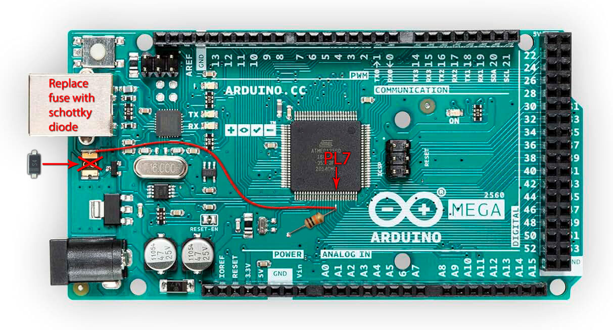

## About STk500v2 dual serial bootloader: 

This STK500v2 modified bootloader is designed to provide OTA on Arduino Mega 2560 board connected to ESP8266/ESP32 module.

The bootloader provides to flash MCU through two different UART ports: UART0 (Arduino Serial), connected to PC, and UART2 (Arduino Serial2) connected to ESP32 (for OTA).

By default, the bootloader expects firmware uploads over UART2 which is connected to an ESP32 module implementing OTA functionality.

When direct connecting to PC, with USB cable, a high level is applied to PL7 input, this force to switch the bootloader to UART0.

## Board modification: 

The board [modification](./docs/arduino-mega2560-schematic.pdf) involves: 
 - replacing the fuse to Schottky diode;
 - connecting USB +5V to the PL7 input;
 - pull-down PL7-input with the 1-100 kΩ resistor.

## Changes to original STK500v2 bootloader: 

The main changes of this bootloader to STK500v2, used on Arduino IDE are:
 - removing definitions for all MCU except ATmega2560;
 - add code for detecting PL7 state (which can be redefined);
 - add code for UART switching (UART ports can also be redefined).